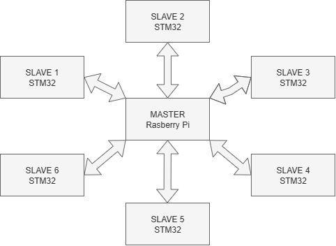
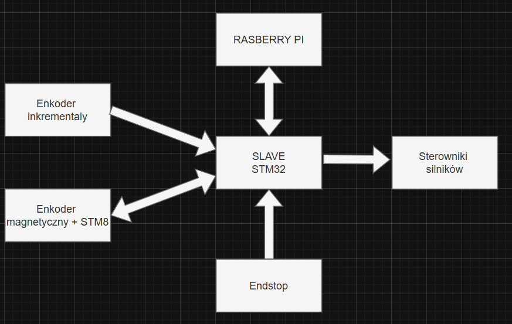

# 6-DOF Robotic Arm Project

## Project Overview

The main goal of this project is to design and build a **fully functional 6-axis robotic arm** using **3D-printed components**. The project has a strong **educational focus**, allowing experimentation with mechanics, electronics, and control systems. However, the robotic arm is **not intended to be a static display**. Its final application and practical use cases will be described at a later stage of the project.

---

## 1. Mechanical Construction


The entire structure of the robotic arm is based on **custom 3D-printed parts**. Each axis is driven by **stepper motors**. While other motor types could offer better performance, stepper motors were chosen due to their **availability and favorable cost** at the time of development.

Some axes use **dual-motor configurations** to increase available torque. In the current configuration, the torques generated by each axis (assuming **70% gearbox efficiency**) are as follows:

### Axis Torque Summary

| Axis | Motor Model           | Number of Motors | Motor Torque [Nm] | Gear Ratio | Output Torque [Nm] |
| ---: | --------------------- | ---------------- | ----------------- | ---------- | ------------------ |
|    1 | 57HS56-2804 (NEMA 23) | 1                | 1.26              | 17:1       | 15.0               |
|    2 | 57HS76-2804 (NEMA 23) | 2                | 1.89              | 17:1       | 45.0               |
|    3 | 57HS56-2804 (NEMA 23) | 2                | 1.26              | 17:1       | 30.0               |
|    4 | 57HS56-2804 (NEMA 23) | 1                | 1.26              | 17:1       | 15.0               |
|    5 | 42HS40-1704 (NEMA 17) | 2                | 0.40              | 17:1       | 9.5                |
|    6 | 42HS40-1704 (NEMA 17) | 1                | 0.40              | 17:1       | 4.8                |

> **Note:** Axis 2 will be redesigned due to insufficient output torque. A higher gear ratio will be used to improve performance.


---

## 2. System Architecture



As shown above, the **central controller** of the robotic arm is a **Raspberry Pi 3B+**. It manages six independent **slave controllers**, each based on **STM32F103** or **STM32F401** microcontrollers.

This distributed architecture was chosen to achieve:

* **High flexibility** of the system
* **Improved reliability** (failure of one slave does not disable the entire arm)
* **Easy future modifications and extensions**
* **Reduced computational load per controller**, as tasks are distributed across six independent units

### Responsibilities of the Raspberry Pi (Master)

1. Computing the **inverse kinematics** of the robotic arm
2. Providing the **human–machine interface (HMI)**
3. Sending **target angles** to each axis controller

---



Each **slave controller** is responsible for:

1. **Communication** with the master (receiving target angles)
2. **Motor control** for the assigned axis
3. **Encoder handling**:
   * Robot joint shaft position (incremental or magnetic encoder)
   * Motor shaft position (magnetic encoder)
4. **Endstop handling** for the assigned axis

---

## 3. Communication Protocols Used in the System

### 3.1 STM32 – Raspberry Pi Communication


> ⚠️ **Important note:**
> The current communication protocol is **overengineered** and will be **redesigned into a simpler and more robust solution** in the future. The diagrams above illustrate the general concept used in the current implementation.

---

## Appendix A. STM32–Raspberry Pi Communication Protocol Specification

### A.1 Frame Structure Overview

The protocol defines **three types of communication frames**, each serving a specific role in the data exchange process between the **Master** and **Slave** units.


---

### A.1.1 Command Frame (Master → Slave)

The **Command Frame** is the primary mechanism for sending commands from the Master to a Slave. It has a **fixed length of 25 bytes** (`BUFFER_FRAME_SIZE`), ensuring deterministic transmission and simplifying **DMA buffer handling**.

#### Table A.1 – Command Frame Structure

| Offset | Size | Field      | Description                |
| -----: | ---- | ---------- | -------------------------- |
|      0 | 1 B  | START_BYTE | Start byte (`0xAA`)        |
|      1 | 1 B  | SLAVE_ID   | Slave identifier (`0x01`)  |
|      2 | 1 B  | COMMAND    | Command code (`0x01–0x07`) |
|      3 | 1 B  | LENGTH     | Payload length (`0–20`)    |
|   4–23 | 20 B | DATA       | Payload data               |
|     24 | 1 B  | END_BYTE   | End byte (`0xBB`)          |

The `START_BYTE` and `END_BYTE` act as **frame delimiters**, allowing detection of frame boundaries and basic integrity validation. The `SLAVE_ID` field enables multi-slave addressing; however, the current implementation uses a single slave with ID `0x01`.

---

### A.1.2 Acknowledgement Frame (Slave → Master)

After receiving and validating a Command Frame, the Slave responds with an **Acknowledgement Frame**. Unlike the Command Frame, this frame has a **variable length** of `5 + LENGTH` bytes, where `LENGTH` specifies the number of echoed data bytes.

#### Table A.2 – Acknowledgement Frame Structure

|      Offset | Size     | Field      | Description               |
| ----------: | -------- | ---------- | ------------------------- |
|           0 | 1 B      | START_BYTE | Start byte (`0xAA`)       |
|           1 | 1 B      | SLAVE_ID   | Slave identifier (`0x01`) |
|           2 | 1 B      | ERROR_CODE | Error code (`0x00–0x08`)  |
|           3 | 1 B      | LENGTH     | Echo data length (`0–20`) |
| 4–(4+LEN-1) | Variable | DATA       | Echoed payload            |
|       4+LEN | 1 B      | END_BYTE   | End byte (`0xBB`)         |

The `ERROR_CODE` field informs the Master about the result of frame validation. A value of `0x00` (`NO_ERROR`) indicates successful reception, while other values correspond to specific detected errors.

---

### A.1.3 ACK Frame (Master → Slave)

The **ACK Frame** is the final step in the **three-stage handshake mechanism**. It is the shortest frame in the protocol and consists of only **4 bytes**.

#### Table A.3 – ACK Frame Structure

| Offset | Size | Field      | Description                                   |
| -----: | ---- | ---------- | --------------------------------------------- |
|      0 | 1 B  | START_BYTE | Start byte (`0xAA`)                           |
|      1 | 1 B  | SLAVE_ID   | Slave identifier (`0x01`)                     |
|      2 | 1 B  | ACK        | Acknowledgement (`0x01 = OK`, `0x00 = ERROR`) |
|      3 | 1 B  | END_BYTE   | End byte (`0xBB`)                             |

---

### A.5 Command Set (Master → Slave)

This section describes all commands supported by the communication protocol. Each command is identified by a unique command code and may optionally contain a payload, depending on its function.

---

#### A.5.1 START_HOMING (`0x01`)

This command initiates the **homing procedure**, used to find the motor reference position.

The process consists of moving the axis toward its **endstop** at a minimal speed until a signal edge is detected. After successful homing, the current motor position is treated as the **reference point (zero position)** for all subsequent movements.

* **Payload:** none
* **LENGTH:** `0`

---

#### A.5.2 START_MOVING (`0x02`)

This command triggers a **rotational movement** by a specified angle.

The payload contains the target angle expressed in **degrees**, encoded as a **32-bit floating-point value (IEEE 754, float32)** in **Little-Endian** format.

* **Payload size:** 4 bytes
* **LENGTH:** `4`
* **Data format:** `float32 (Little-Endian)`

**Encoding example:**

Target angle: `90.0°`

* IEEE 754 (hex): `0x42B40000`
* Little-Endian byte order: `00 00 B4 42`

---

#### A.5.3 GET_STATUS (`0x03`)

This command requests the **current status of the Slave unit**, including:

* Motor position
* Endstop state
* Active state of the internal state machine

**Parameters:**
* **Payload:** none
* **LENGTH:** `0`

---

#### A.5.4 STOP (`0x04`)

This is an **emergency stop command**.

It immediately interrupts the currently executed motion and disables the control signal generator, stopping the motor as fast as possible.

* **Payload:** none
* **LENGTH:** `0`

---

#### A.5.5 CHANGE_MOVEMENT_VALUES (`0x05`)

This command allows modification of **motion profile parameters** without reprogramming the microcontroller.

The payload contains **four 16-bit values**, encoded in **Little-Endian** format.

* **Payload size:** 8 bytes
* **LENGTH:** `8`

**Payload structure:**

| Bytes | Parameter            | Unit    |
| ----: | -------------------- | ------- |
|   0–1 | Minimum speed        | steps/s |
|   2–3 | Maximum speed        | steps/s |
|   4–5 | Maximum acceleration | deg/s²  |
|   6–7 | Maximum jerk         | deg/s³  |

---

#### A.5.6 START_DIAGNOSTIC (`0x06`)

This command starts a **diagnostic procedure** that verifies the correct operation of all major subsystems, including:

* Control signal generators
* GPIO interfaces
* Sensors

**Parameters:**
* **Payload:** none
* **LENGTH:** `0`

---

#### A.5.7 ACCEPT_CONFIRMATION (`0x07`)

This is a **special command used to reset the Slave unit** after task completion.

After receiving this command:

* The Slave sets GPIO pin **PB6** to a low state
* The internal state machine transitions to **IDLE**
* The unit signals readiness to accept a new command

**Parameters:**
* **Payload:** none
* **LENGTH:** `0`

---

### A.6 Error Codes

The error detection system is a critical element ensuring **communication reliability**. Any issue detected during frame validation results in an appropriate **error code** returned in the acknowledgement frame.

#### Table A.4 – Protocol Error Codes

| Code | Name                     | Description                                        |
| ---: | ------------------------ | -------------------------------------------------- |
| 0x00 | NO_ERROR                 | No error, frame is valid                           |
| 0x01 | WRONG_START_BYTE         | Invalid start byte                                 |
| 0x02 | NO_SUCH_COMMAND          | Unknown command code                               |
| 0x03 | WRONG_LENGTH             | Payload length does not match command requirements |
| 0x04 | WRONG_END_BYTE           | Invalid end byte                                   |
| 0x05 | ALLOCATION_ERROR         | Memory allocation error                            |
| 0x06 | WRONG_START_BYTE_CONF    | Invalid start byte in ACK frame                    |
| 0x07 | WRONG_END_BYTE_CONF      | Invalid end byte in ACK frame                      |
| 0x08 | BEFORE_USING_RESET_SLAVE | Slave reset required before issuing a new command  |

Frame validation is performed **sequentially** and terminates immediately upon detection of the first error. The validation process includes:

* Verification of START and END bytes
* Validation of the Slave ID
* Command code verification
* Consistency check between the LENGTH field and the command requirements

---

## Appendix B. AS5600 Magnetic Encoder Communication Protocol

The communication system with the **AS5600 magnetic encoder** is implemented using a **three-layer architecture**, where an **STM8 microcontroller** acts as an intermediary between the sensor and the higher-level control unit (STM32).

This design choice results from the limitations of the **I2C interface**, which is not suitable for reliable communication over distances greater than several tens of centimeters in environments with **high electromagnetic interference (EMI)**.


---

### B.1 System Architecture

#### B.1.1 Data Acquisition Layer


The AS5600 magnetic encoder communicates with the STM8 via the **I2C interface**. The STM8 operates in **continuous mode**, cyclically reading data from the sensor and processing it into three physical quantities:

* **Angular position** — current shaft position in the range `0–360°`
* **Angular velocity** — calculated as the time derivative of position
* **Angular acceleration** — calculated as the time derivative of velocity

These values are stored in **dedicated internal registers** of the STM8 and updated in each iteration of the main loop.

---

#### B.1.2 Transmission Layer

Communication between the **STM8 and STM32** is implemented using the **RS-485 bus**. This standard was selected to ensure **reliable transmission over distances of 2–2.5 meters** in an environment with significant EMI generated by stepper motors and power wiring.

The signal path is as follows:

1. STM8 generates a data frame and sends it via UART
2. A UART–RS-485 transceiver converts the signal to differential form
3. The differential signal is transmitted over a shielded RS-485 cable
4. An RS-485–UART transceiver converts the signal back to UART
5. STM32 receives the data frame via UART

---

#### B.1.3 Application Layer

At the application level, a simple **master–slave protocol** is defined:

* **Master (STM32):** initiates communication and requests register values
* **Slave (STM8):** responds to requests by returning the requested data

---

### B.2 Communication Frame Structure

The protocol defines a **minimalist frame structure**, optimized for **low transmission overhead** and **ease of implementation**.

---

#### B.2.1 Request Frame (Master → Slave)

The request frame sent by the STM32 consists of **three bytes**.

**Table B.1 – Request Frame Structure**

| Offset | Size | Field      | Description                       |
| -----: | ---- | ---------- | --------------------------------- |
|      0 | 1 B  | START_BYTE | Start byte (`0xAA`)               |
|      1 | 1 B  | REG_ID     | Register identifier (`0x01–0x03`) |
|      2 | 1 B  | END_BYTE   | End byte (`0x55`)                 |

---

#### B.2.2 Response Frame (Slave → Master)

The response frame sent by the STM8 contains the requested register value.

**Table B.2 – Response Frame Structure**

| Offset | Size | Field      | Description                                 |
| -----: | ---- | ---------- | ------------------------------------------- |
|      0 | 1 B  | START_BYTE | Start byte (`0xAA`)                         |
|      1 | 1 B  | REG_ID     | Register identifier (echo)                  |
|    2–3 | 2 B  | DATA       | Register value (Little-Endian, 16-bit)      |
|      4 | 1 B  | END_BYTE   | End byte (`0x55`)                           |

---

### B.3 Data Registers

The STM8 exposes three registers containing processed data from the encoder:

**Table B.3 – Available Encoder Registers**

| ID   | Name         | Unit       | Description                              |
| ---: | ------------ | ---------- | ---------------------------------------- |
| 0x01 | POSITION     | [ticks]    | Current angular position (0–4095)        |
| 0x02 | VELOCITY     | [ticks/s]  | Angular velocity                         |
| 0x03 | ACCELERATION | [ticks/s²] | Angular acceleration                     |

The AS5600 encoder offers **12-bit resolution**, corresponding to **4096 levels per full rotation**. 

**Conversion to degrees:**

```
θ[°] = (POSITION / 4096) × 360°
```

---

## 4. Stepper Motor Motion Algorithm

The motion of the stepper motors in this robotic arm is currently implemented using **relatively simple algorithms**. These basic control routines handle fundamental movements reliably but **do not yet optimize the full trajectory**.

The planned algorithm will integrate:

* **S-curve profiles** for smooth acceleration and deceleration across the entire trajectory.
* **PID control** to maintain accurate motor speed and reduce overshoot or lag.

A detailed description of the algorithm, including equations, tuning parameters, and implementation notes, can be found in the separate file: [Stepper Motor Algorithm Details](path/to/stepper_algorithm_details.md).

This approach ensures precise and smooth motion while maintaining safe operation and reducing mechanical stress on the arm.


## Future Development

The project is **under active development**. Mechanical redesigns, protocol simplification, and software improvements are planned.

---

## Author

*Project developed as part of an engineering thesis.*
